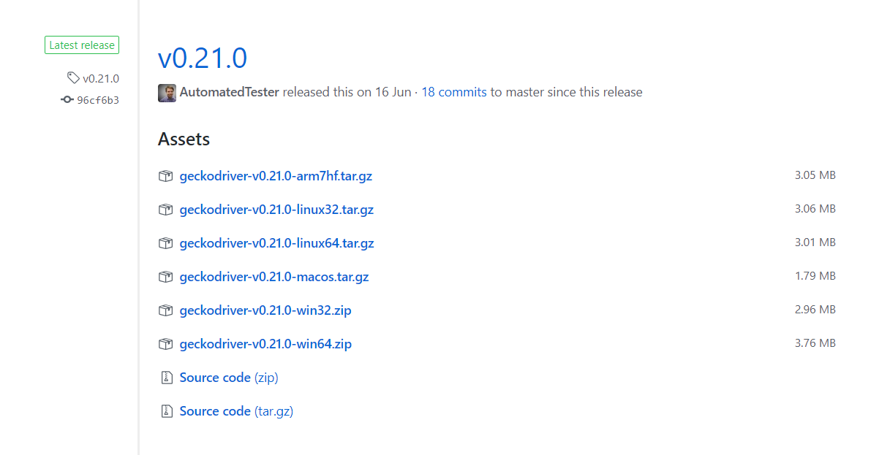

# 1.2.4 GeckoDriver 的安装

selenium对firefox浏览器操作，需要进行以下配置

## 1.相关链接

* 下载地址：[https://chromedriver.storage.googleapis.com/index.html](https://github.com/mozilla/geckodriver/releases)

## 2.下载GeckoDriver



## 3.环境变量配置

下载完成后将geckodriver可执行文件配置到环境变量中

在windows平台下，直接把可执行文件拖入python的Scripts目录下，这样就配置到环境变量中了

在 Linux、Mac 下，需要将可执行文件配置到环境变量或将文件移动到属于环境变量的目录里。

例如移动文件到 /usr/bin 目录，首先命令行进入其所在路径，然后将其移动到 /usr/bin：

```text
sudo mv geckodriver /usr/bin
```

当然也可以将 GeckoDriver 配置到 $PATH，首先可以将可执行文件放到某一目录，目录可以任意选择，例如将当前可执行文件放在 /usr/local/geckodriver 目录下，接下来可以修改 ~/.profile 文件，命令如下：

```text
vi ~/.profile
```

添加如下一句配置：

```text
export PATH="$PATH:/usr/local/geckodriver"
```

保存然后执行如下命令即可完成配置：

```text
source ~/.profile
```

## 5.验证安装

在命令行下输入GeckoDriver命令进行验证有类似结果输出就代表配置环境成功

然后在程序中测试

```text
from selenium import webdriver

browser = webdriver.Firefox()
```

如果有Firefox浏览器自动打开，就代表配置成功

